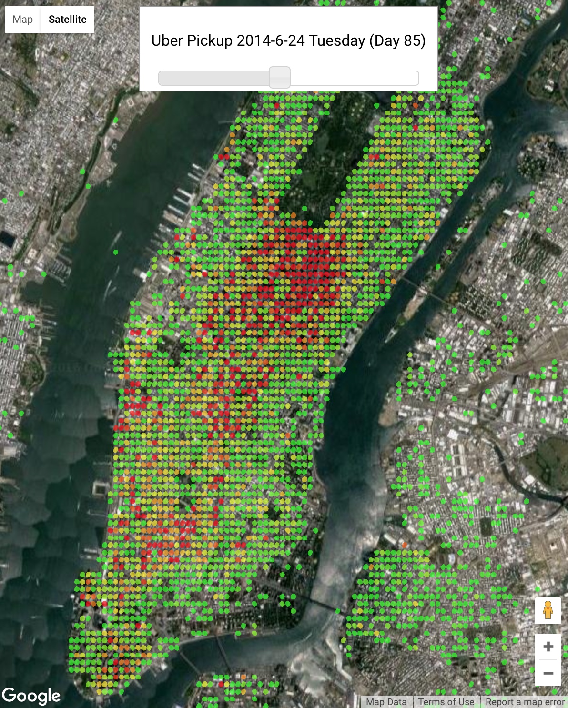
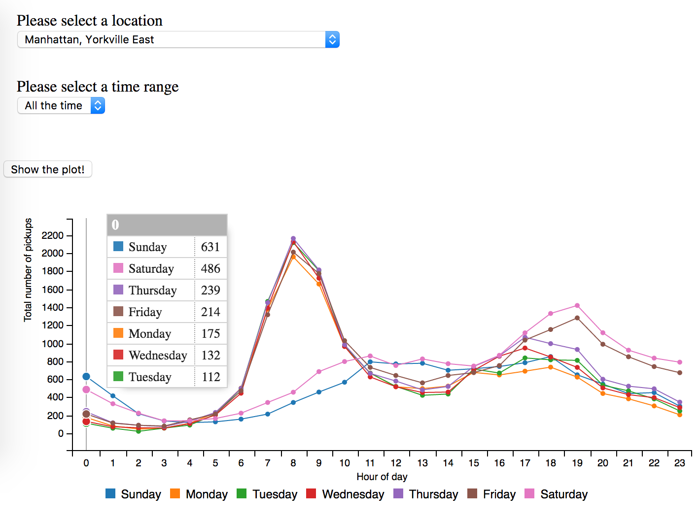

## Data Source

https://github.com/fivethirtyeight/uber-tlc-foil-response

## Space Visualization

http://104.197.248.161/xinran/xinran_uber_2014_map.html

## Time Series Plots

http://104.197.248.161/xinran/xinran_uber_2015_plot.html

